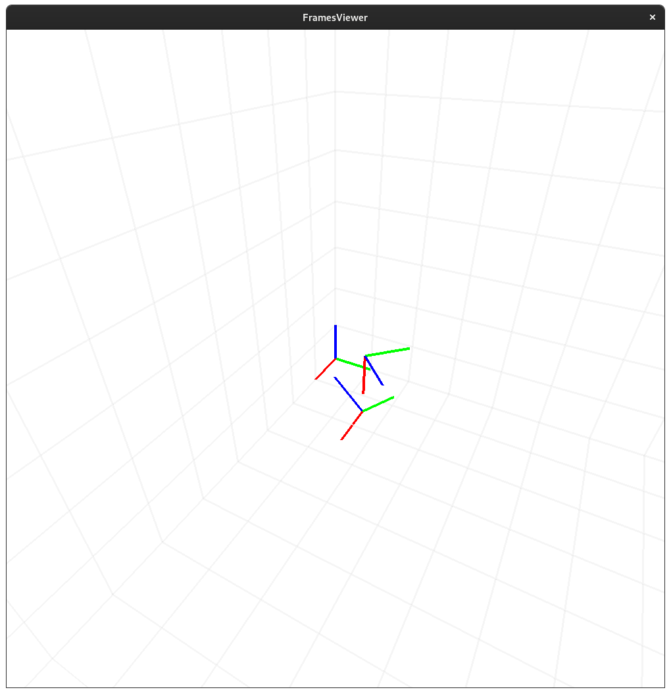

# FramesViewer 

A simple live 6D frames viewer



## Installation
```python
pip3 install -e .
```

## Example : 
```python
from FramesViewer import FramesViewer
from FramesViewer import utils as fv_utils
import time

fv = FramesViewer()
fv.start()

# Frames
frame1 = fv_utils.make_pose([0.15, 0.15, 0], [45, 0, 0])
frame2 = fv_utils.make_pose([0.15, 0.15, 0.15], [0, 90, 45])
frame3 = frame2.copy()

fv.pushFrame(frame1, "frame1", [1, 0, 0])
fv.pushFrame(frame2, "frame2", [0, 1, 0])

fv.pushFrame(frame3, "frame3")
fv.deleteFrame("frame3")


# Points
for i in range(10):
    for j in range(10):
        for z in range(10):
            fv.pushPoint([i*0.1, j*0.1, z*0.1], "a", (1, 0, 0), 10)

# An infinite loop is needed to keep the viewer thread alive.
while True:
    frame2 = fv_utils.translateAbsolute(frame2, [0, 0.0005, 0])
    frame2 = fv_utils.rotateInSelf(frame2, [0.5, 0.5, 0.5])
    fv.pushFrame(frame2, "frame2", [0, 1, 0])
    time.sleep(0.01)

```

Once `fv.start()` is called, the viewer runs in a separate thread. 

You can then dynamically call `fv.pushFrame(...)` to add, update or remove frames.


